# Инструкция по быстрой настройке VPS и конфигурации Xray/Vless прокси

За последние пару лет в интернете, в частности, скопилось много статей на данную тему, там зачем же еще одна? Лично для меня была проблема в том, чтобы найти всю информацию по базовой настройке сервера (обновление, защита и т.д.) и в дополнение к этому быстрый способ настройки VLESS в одной статье. Обычно я натыкался на статьи, где есть настройка панели 3X-UI (и то, как я понял, читая комментарии под такими статьями, не всегда правильная) без базовой настройки самого VPS, либо статьи, где всё написано слишком детально, а «много букав» читать, да ещё в последствии воспроизводить лениво в наше время.

Поэтому в данной инструкции я решил собрать в одном месте и базовую настройку сервера (которую может сделать практически любой, не слишком мудря с настройками), так и настройку XRAY без панели 3X-UI всего за пару скриптов.

Я пытался сделать статью для новичков, но при этом соблюсти какой-то баланс и не вдаваться в мельчайшие делали на каждом шагу, по типу нажмите такие-то клавиши чтобы открыть консоль, если возникнут какие-то проблемы, думаю вам вполне поможет гугл или любая нейросеть.

И перед началом хочется сказать, что инструкция по настройке VLESS позаимствована из этого [репозитория](https://github.com/xVRVx/autoXRAY), также [статья](https://habr.com/ru/articles/909910/) на хабре и часть по базовой настройке сервера, если хотите почитать подробнее, из инструкции на [GitHub](https://github.com/EmptyLibra/Configure-Xray-with-VLESS-Reality-on-VPS-server).

Весь процесс включает 3 основных шага: аренда VPS, настройка VPS и настройка Xray/Vless.

## Шаг 1. Аренда VPS

Первое что нужно сделать это арендовать виртуальный выделенный сервер или же VPS (Эта часть статьи будет наименее подробной дабы не провоцировать лишний раз цензоров к блокировкам определенного хостера).

Если вы развертываете VPN только для себя или же для узкого круга людей (в моем случае было до 5 человек) и планируете пользоваться не слишком часто, то, как показал мой опыт, сервера за 1-2$ в месяц с самыми базовыми параметрами вполне может хватить (но оперативной памяти желательно 1ГБ), тут, наверное, нужно смотреть только на лимит трафика в месяц.

Операционную систему лучше выбрать Debian 12 или Ubuntu 24, дальнейшие настройки будут показаны на Debian 12.

Для VPS можете выбрать любую иностранную страну, желательно с наименьшей цензурой в интернете и ближайшей к вам по местоположению (от этого может зависеть задержка соединения). Также обратите внимания есть ли возможность оплаты сервера удобным для вас способом (иногда при покупке требуют указать паспортные данные, но не всегда их проверяют).

<div align="center">
  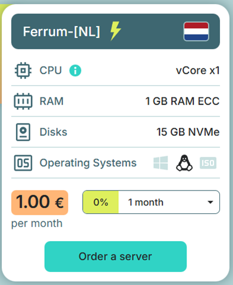
  <p><em>Пример карточки с VPS для аренды</em></p>
</div>

После оплаты VPS вам на почту будут высланы данные для входа на сервер из консоли. Сохраните их где-нибудь.

<div align="center">
  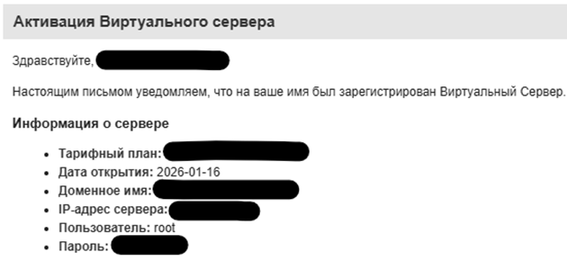
  <p><em>Пример данных для входа на сервер</em></p>
</div>

Думаю, самая сложная часть уже пройдена, дальше отступать некуда, деньги были потрачены, теперь задача сделать так, чтобы они не были потрачены впустую, поэтому продолжим)

Если с настройкой сервера что-то пойдет не по плану, вы всегда можете сбросить или переустановить систему через административную панель провайдера и начать всё заново.

## Шаг 2. Базовая настройка VPS

Сперва нужно подключится к арендованному серверу. Для этого откройте командную строку или powershell.

После этого, в открывшемся окне пропишите следующую команду и нажмите **Enter** (введите ip-адрес, сохраненный на предыдущем шаге):

`ssh root@ip_адрес_сервера`

<div align="center">
  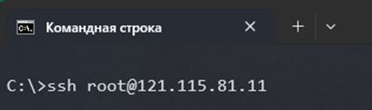
  <p><em>Пример ввода команды в консоль</em></p>
</div>

При первом подключении SSH спросит про **fingerprint**, ответьте **yes**.

После, вас попросят ввести пароль, можете скопировать его, из сохраненных данных в прошлом шаге и вставить (скорее всего вставка в консоль по нажатию на ПКМ) или ввести вручную, пароль не будет видно в консоли, это нормально, поэтому не пытайтесь его вставить несколько раз)

Теперь проведем настройку и обеспечим базовую безопасность сервера.

#### 1. Смена пароля root:

Вводим команду `passwd` в консоль и прописываем новый пароль (чем длиннее тем лучше), теперь при повторном подключении к серверу нужно будет вводить именно его, а не начальный пароль.

#### 2. Обновление пакетов и перезагрузка сервера:

Вводим команду `apt update && apt upgrade -y && reboot` в консоль, после чего нужно подождать около 5-10 минут (если появится розовое/синее окно, просто нажмите **Enter**), после чего сервер перезагрузится и к нему нужно будет подключится заново.

#### 3. Создание нового пользователя:

Подключаемся и вводим команду `adduser user_name` в консоль, где вместо `user_name` впишите ваше любое придуманное имя пользователя (пример команды `adduser lorem`), далее введите новый пароль для пользователя и также сохраните эти данные где-нибудь (другие вопросы по при создании можно пропустить, нажав **Enter**).

После, введите следующую команду `usermod -aG sudo user_name` где `user_name` ваше новое имя пользователя.

Если понадобится, перейти от обычного пользователя к **root** можно командой `su -` от суперпользователя к обычному командой `su user_name`.

#### 4. Новый порт для подключения по SSH:

Теперь нужно поменять стандартный порт для подключения по SSH. Для этого введите в консоль команду `nano /etc/ssh/sshd_config` после чего в консоли откроется текстовый редактор (все команды выполняются от пользователя **root**).

Перемещайтесь стрелочками на клавиатуре. Мышка здесь не работает. В данном окне нужно изменить две строчки, находим строчку **#Port 22** где нужно убрать # и поменять цифру **22** на любой не занятый из диапазона **10001-65535** (посмотреть занятые порты можно командой `ss -lntup`) порт.

Также ищем строчку **PermitRootLogin yes** и меняем **yes** на **no**. Сохраняем файл, нажав **Ctrl + O**, затем **Enter**, закрываем файл, нажав **Ctrl + X**. Далее выполняем команду `systemctl restart sshd`.

<div align="center">
  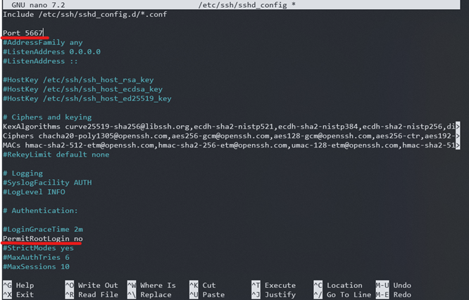
  <p><em>Пример измененных данных</em></p>
</div>

Теперь подключение к серверу будет происходить по команде:

`ssh user_name@ ip_адрес_сервера -p новый_порт`

<div align="center">
  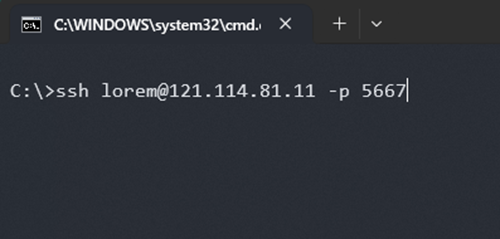
  <p><em>Пример входа на сервер с новыми данными</em></p>
</div>

В результате этого шага мы запретили пользователю root входить на сервер, также запретили входить на сервер со стандартного порта 22 и теперь подключение осуществляется созданным на прошлом шаге пользователем по новому порту.

Также, как написано во многих статьях, безопаснее сделать вход на сервер по ключам, здесь я не буду на этом останавливаться, почитать подробнее, можете в [инструкции](<https://github.com/EmptyLibra/Configure-Xray-with-VLESS-Reality-on-VPS-server/blob/master/%D0%98%D0%BD%D1%81%D1%82%D1%80%D1%83%D0%BA%D1%86%D0%B8%D1%8F%20%D0%BF%D0%BE%20%D0%BD%D0%B0%D1%81%D1%82%D1%80%D0%BE%D0%B9%D0%BA%D0%B5%20%D1%81%D0%B2%D0%BE%D0%B5%D0%B3%D0%BE%20Xray-%D1%81%D0%B5%D1%80%D0%B2%D0%B5%D1%80%D0%B0%20(VLESS%20XTLS-Reality+3X-UI%20%D0%BD%D0%B0%20VPS)%20%D0%B2%202024-2025%D0%B3.md#%D1%88%D0%B0%D0%B3-3-%D0%B1%D0%B0%D0%B7%D0%BE%D0%B2%D0%B0%D1%8F-%D0%BD%D0%B0%D1%81%D1%82%D1%80%D0%BE%D0%B9%D0%BA%D0%B0-%D0%B8-%D0%BE%D0%B1%D0%B5%D1%81%D0%BF%D0%B5%D1%87%D0%B5%D0%BD%D0%B8%D0%B5-%D0%B1%D0%B5%D0%B7%D0%BE%D0%BF%D0%B0%D1%81%D0%BD%D0%BE%D1%81%D1%82%D0%B8-%D1%81%D0%B5%D1%80%D0%B2%D0%B5%D1%80%D0%B0>).

#### 5. Установка Fail2ban:

Fail2ban — это программа для защиты серверов, которая автоматически блокирует IP адреса злоумышленников после повторяющихся неудачных попыток входа.

Выполняем команды (от root пользователя) `apt install rsyslog` далее `apt install fail2ban` и после `nano /etc/fail2ban/jail.local` для создание базовой конфигурации.

В открывшемся текстовом редакторе вставляем следующий текст (в строке **port** вставьте свой новый порт для входа по SSH):

```
[DEFAULT]
bantime = 10m
findtime = 10m
maxretry = 5

[sshd]
enabled = true
port = 5667
filter = sshd
logpath = /var/log/auth.log
maxretry = 5
bantime = 1h
findtime = 10m
```

Сохраняем файл, нажав **Ctrl + O**, затем **Enter**, закрываем файл, нажав **Ctrl + X**. Выполняем команду `systemctl restart fail2ban` далее `systemctl status fail2ban` для проверки работоспособности и `systemctl enable fail2ban`.

#### 6. Настройка Firewall:

Выполняем команду `apt install ufw -y`. Разрешаем нужные для VPN порты, выполняем по очереди команды:

```
ufw allow OpenSSH
ufw allow 80
ufw allow 443
ufw allow 8442
ufw allow 8443
ufw allow 10443
```

Также необходимо разрешить порт для входа по SSH указанным в шаге 4, иначе не получится зайти на сервер: `ufw allow 5667` (укажите свой порт)

Включаем и проверяем Firewall: `ufw enable` (спросит подтверждение, соглашаемся), далее `ufw status verbose`.

В выводе должно быть что-то по типу:

```
Status: active
Default: deny (incoming), allow (outgoing)
…
```

Попробуйте зайти на сервер из нового окна консоли не закрывая предыдущее, чтобы убедится, что вы не потеряли доступ к серверу, если что-то пошло не так выполняем команду `sudo ufw disable` в старой сессии консоли.

На этом с базовой настройкой сервера покончено, осталось настроить Xray и получить конфиги VLESS.

## Шаг 3. Настройка XRAY/VLESS

Итак, сперва нужно получить свой домен. Будем использовать бесплатный домен от **FreeDNS** (можете использовать любой другой вариант), конечно, предпочтительнее использовать платные варианты, но, как показывает мой опыт и бесплатный вариант вполне нормально работает.

Заходим и регистрируемся на сайте:

<div align="center">
  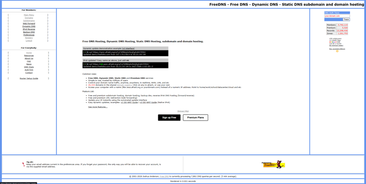
  <p><em>Сайт FreeDNS</em></p>
</div>

После чего в левом верхнем меню **For Members** переходим в раздел **Registry**. В данном разделе выбираете любой понравившейся вам домен и переходите на его страницу.

В поле **Subdomain** нужно придумать и ввести ваш домен, в поле **Destination** ввести IP-адрес вашего VPS, после чего вводите капчу и жмете кнопку **Save**.

<div align="center">
  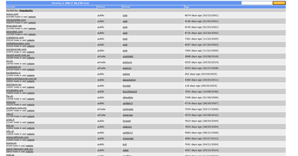
  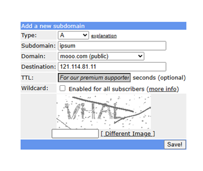
  <p><em>Пример заполнения данных</em></p>
</div>

Далее вы попадете на страницу **Subdomains** откуда вам нужно скопировать получившуюся ссылку и сохранить её (пример **ipsum.mooo.com**).

Нужно подождать примерно от 5 до 20 минут пока домен привяжется в IP-адресу сервера, прежде чем продолжать дальше. Проверить привязан ли поддомен можно командой `ping ваш_домен` Если вы не видите ошибку по типу **Name or service not known** значит можно продолжать дальше.

Возвращаемся в консоль к нашему серверу, если выходили с сервера, при входе перейдите к **root** пользователю командой `su –`. Копируем или вводим bash-скрипт в консоль для автоматической установки и настройки сервера VPN на базе Xray (VLESS Reality / XHTTP / Shadowsocks 2022) с nginx и HTTPS (Let’s Encrypt) под указанный домен (также нужно сказать, что нельзя без проверки выполнять всякие скрипты из интернета, поэтому нужно проверять скрипты перед выполнением, но, так как мы тут дилетанты, продолжим как есть). Для удобства можете скопировать команду и отредактировать её в текстовом редакторе:

`bash -c "$(curl -L https://raw.githubusercontent.com/xVRVx/autoXRAY/main/autoXRAYselfConfRUxhttp.sh)" -- ваш_домен`

где `ваш_домен` — это домен, скопированный с прошлого шага.

<div align="center">
  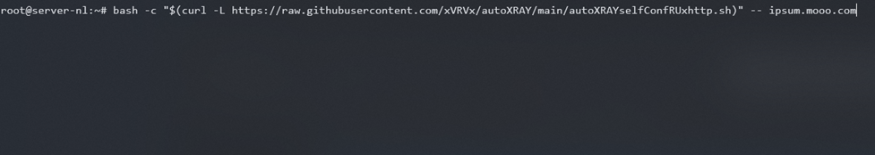
  <p><em>Пример команды</em></p>
</div>

После выполнения команды в консоли должен появится такой вывод, скопируйте и сохраните его:

<div align="center">
  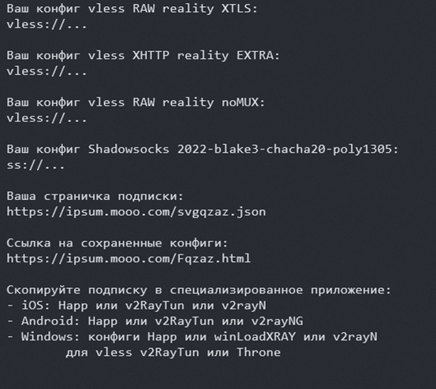
  <p><em>Вывод конфигураций и подписки</em></p>
</div>

Далее нужно скопировать либо URL подписки, либо каждый конфиг в приложение, предложенное в конце. В большинстве приложений логика схожа, нужно скопировать ссылку или конфиг и в приложении нажать на кнопку «Вставить из буфера обмена» или похожую.

<div align="center">
  
  <p><em>Пример в приложении Happ</em></p>
</div>

На этом можно было бы и закончить, но есть вероятность что данный вариант реализации VPN может не заработать, особенно через мобильную сеть, но у нас есть выход из данной ситуации (пока что).

## Шаг 4 (дополнительный). Создание моста RU -> EU

Так как в прошлом варианте VPN мы подключаемся напрямую к зарубежному серверу, это может не понравится цензорам, что как следствие приводит к невозможности использования данного способа, особенно на мобильных сетях. Выход из данной ситуации это создание дополнительного сервера на территории, где цензор терпимее относится (пока что) к подключению к серверам, например в Москве.

Итак, для реализации данного способа нужно арендовать ещё один сервер и полностью выполнить шаги 1 и 2 для создания и настройки нового VPS. Далее нужен новый поддомен, который можно добавить, нажав на **[add]** во вкладке **Subdomains** на сайте **FreeDNS** (не забудьте проверить привязан ли ваш новый домен к серверу командой `ping ваш_новый_домен`).

<div align="center">
  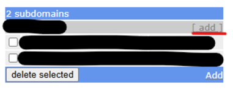
</div>

Также, вам понадобится конфиг **vless XHTTP reality EXTRA** сгенерированный в конце третьего шага.

После всей подготовки нужно прописать следующую команду в консоль на новом сервере:

`bash -c "$(curl -L https://raw.githubusercontent.com/xVRVx/autoXRAY/main/autoXRAYselflConfRUbrEUxhttp.sh)" -- ваш_новый_домен "ваш_сгенерированный_конфигXHTTP"`

где `ваш_новый_домен` — это только что созданный домен и `ваш_сгенерированный_конфигXHTTP` это конфиг **vless XHTTP reality EXTRA** (вставляем конфиг внутрь кавычек).

В итоге установится мост между двумя серверами и выведется новый конфиг для подключения, как в конце шага 3, который позволит нам подключаться к RU серверу, который в свою очередь уже будет подключаться к зарубежному серверу.

Ну и на этом можно заканчивать, поздравляю с настройкой вашего VPN и надеюсь у вас всё заработает с первого раза, повторюсь, если что-то не получилось интернет и нейросети в вашем распоряжении !)
